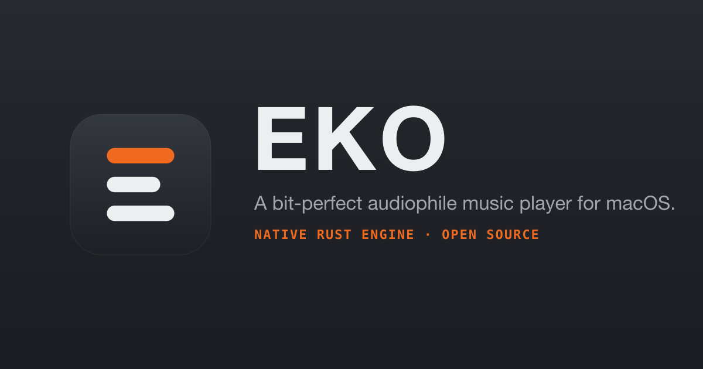

<div align="center">

# EKO

**A bit-perfect audiophile music player for macOS.**

Native Rust audio engine · neumorphic Braun-inspired UI · local files + Navidrome/Subsonic.

[](https://github.com/reactivepixels/eko/actions/workflows/ci.yml)
[](./LICENSE)
[](#requirements)
[](https://tauri.app)



<!-- This is the brand banner. A real app screenshot (captured at 2× from the running app)
     should replace it as the hero once available — see “Screenshots” below. -->

</div>

---

## Why EKO

Most desktop players quietly resample your music through the OS mixer before it reaches
your DAC. EKO doesn't. It decodes natively and plays each track **at its own sample rate**,
copying the decoded samples to the output **untouched** — the same thing Roon and Audirvana
do, in a small, fast, beautiful app you own.

> **Bit-perfect, stated honestly.** The untouched-samples path is taken only when **volume is
> at unity, the EQ is flat, and the output device's rate matches the file's**. Change any of
> those and EKO tells you — the signal-path "seal" reads `BIT-PERFECT`, or honestly downgrades
> to `RESAMPLED` / `EQ` / `VOLUME`. The claim is always falsifiable in the UI.

On macOS, EKO sets the output device's nominal sample rate to match the file (via the
CoreAudio HAL) so a 44.1 kHz track plays at 44.1 and a 96 kHz track plays at 96 — no silent
system resample. Watch **Audio MIDI Setup** follow the music.

## Features

- **Native bit-perfect engine** — `symphonia` decode → `cpal` output at the file's own sample
  rate, with a true bit-perfect bypass when nothing is touching the samples. Supports FLAC,
  ALAC, MP3, AAC, WAV, AIFF, OGG, and Opus.
- **CoreAudio device-rate matching** — EKO owns the output device's nominal rate while playing,
  the way the high-end players do. No OS mixer resample.
- **Honest signal path** — a Roon-style `SOURCE → OUTPUT` chain with a dedicated bit-perfect
  seal that reflects the *actual* state, never an assumption.
- **Real 10-band graphic EQ** — RBJ peaking biquads in the engine (fully bypassed when flat).
- **Spectrum analyser** — a 32-band FFT driven by the engine, rendered as segmented LEDs.
- **Output device selection** — pick your DAC explicitly.
- **ReplayGain** — track/album volume normalisation read from tags and applied as engine gain
  (off = bit-perfect preserved).
- **Gapless playback** — seamless same-rate album playback with no gap between tracks.
- **Local library & servers** — browse and sort a local library, plus Navidrome / OpenSubsonic
  streaming (multi-server) — all through the one engine.
- **Queue management** — reorder the queue, play-next / add-to-queue.
- **Lyrics, scrobbling & sleep timer** — synced/plain lyrics, Last.fm-style scrobbling, and a
  sleep timer.
- **macOS media keys & Now Playing** — F7/F8/F9 and the Control-Center now-playing card drive EKO.
- **Auto-updater** — checks GitHub Releases and offers a one-click background update.
- **Mini player** — a compact always-on-top window that reads engine state directly.
- **Keyboard-first** — space/⏯, seek, volume, next/prev, mute — all from the keyboard.
- **Neumorphic Braun design** — the light/dark **Porcelain** skin (light "Porcelain" + dark
  "Graphite") with a user-selectable accent.

## Screenshots

> Captures from the running app are coming. In the meantime the whole site — and a playable
> "EKO Web Lite" — are live at **[eko.reactivepixels.com](https://eko.reactivepixels.com)**:
> [landing](https://eko.reactivepixels.com) · [docs](https://eko.reactivepixels.com/docs.html)
> · [web player](https://eko.reactivepixels.com/web-player.html).

## Requirements

- **macOS** (Apple Silicon or Intel). EKO is macOS-only for v1 — the bit-perfect device-rate
  matching uses the CoreAudio HAL, which has no cross-platform equivalent. Note: the prebuilt
  DMG is Apple Silicon only for now; Intel users should build from source.
- A DAC or audio interface to hear the difference (though it's a better path on any output).

## Install

Signed, notarized releases and a Homebrew cask (`brew install --cask eko`) are on the
[roadmap](./docs/ROADMAP.md). Until then, **build from source** — it takes a few minutes.

## Build from source

**Prerequisites**

- [Rust](https://rustup.rs) (stable) and [Node.js](https://nodejs.org) 22+ (an `.nvmrc` pins it — `nvm use`).

**Steps**

```bash
git clone https://github.com/reactivepixels/eko.git
cd eko
npm install
npm run tauri dev      # run in development
# or
npm run tauri build    # produce a release .app / .dmg in src-tauri/target/release/bundle
```

**Handy scripts**

```bash
npm run typecheck      # tsc --noEmit
npm run lint           # eslint
npm run format:check   # prettier --check
```

## How it works

EKO is **Tauri 2** — a Rust core with a React + TypeScript webview. The defining decision is
that **all audio lives in Rust, in one engine**: local files and Navidrome streams both decode
in `symphonia` and play through `cpal` at the file's native rate. The frontend is purely UI +
state (Zustand); it never touches samples.

Read the full **[architecture deep-dive](./docs/architecture/overview.md)** and the
**[decision records](./docs/architecture/adr/)** for the *why* behind the one-engine design,
CoreAudio rate-switching, and more.

```
┌── React + TS UI (Zustand state, Tauri invoke/events) ──┐
│   transport · signal path · EQ · spectrum · library     │
└───────────────────────▲────────────────────────────────┘
                         │  commands / status
┌───────────────────────┴────────────────────────────────┐
│  Rust engine (src-tauri)                                 │
│   symphonia decode → cpal @ native rate → CoreAudio      │
│   nominal-rate match → DAC   (bit-perfect bypass)        │
└──────────────────────────────────────────────────────────┘
```

## Tech stack

Tauri 2 · Rust (`symphonia`, `cpal`, `rustfft`) · React 19 + TypeScript · Vite · Zustand.

## Contributing

Contributions are welcome — start with **[CONTRIBUTING.md](./CONTRIBUTING.md)**. It gets you
building in a few minutes and explains where things live. Please also read the
[Code of Conduct](./CODE_OF_CONDUCT.md). Audio-path and startup changes need real-ear
verification — the PR template walks you through it.

## Roadmap & status

See **[docs/ROADMAP.md](./docs/ROADMAP.md)**. The path to v1.0 is gapless playback, ReplayGain,
and resume-last-session, then a signed release. EKO ships excellent and compounds in public.

## License

[MIT](./LICENSE) — use the code freely.

The **EKO** name and logo are unregistered trademarks of Reactive Pixels. The MIT license covers
the code, not the brand: forks and derivative works must use a different name and mark. See the
[NOTICE](./NOTICE) file (referenced from [LICENSE](./LICENSE)) for the full brand notice.
</content>
